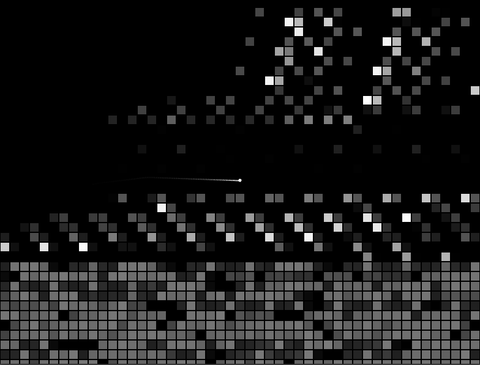
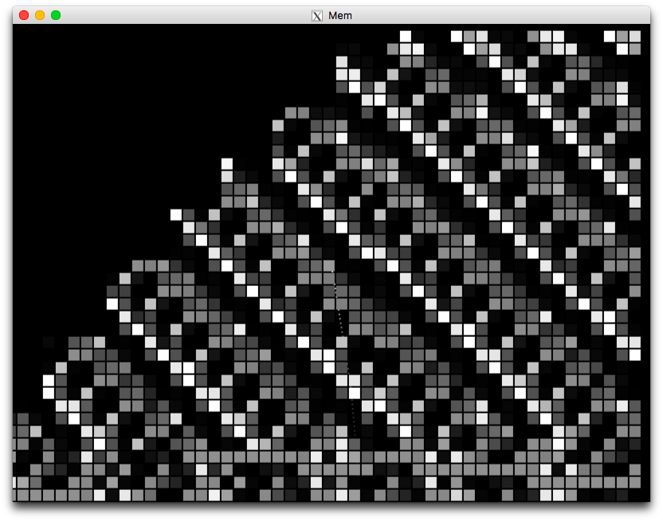
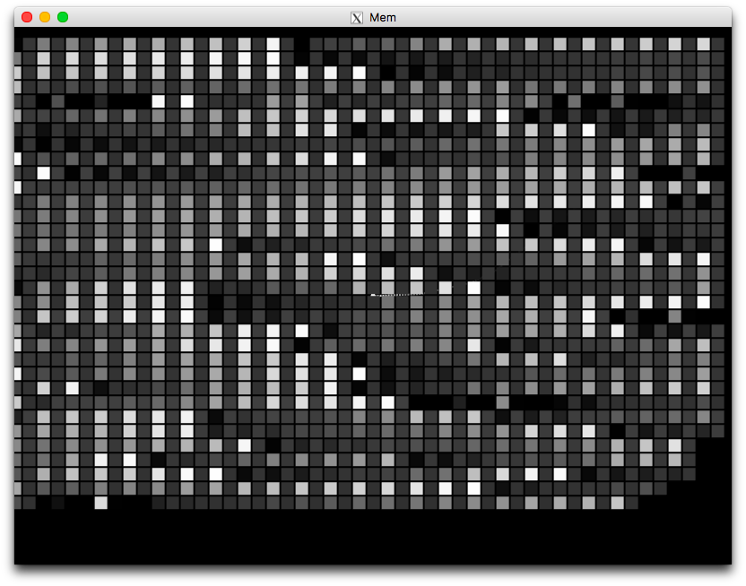

# memgame : A memory exploration adventure game

This is an adventure game that explores the vast memory region in your computer.
You will see a small universe, which is present in your computer.

## Screen Shots




## Libraries which are used in this software
- memorpy (c) Nicolas VERDIER

## Installation / Run
A little complicated.
First, you have to install [Kivy](https://kivy.org/). It is multi-platform graphic library for Python.
Follow this article in order to install Kivy. Use Python 2.7.x. <https://kivy.org/docs/installation/>

then, run following command.

```bash
$ python ./main.py
```

## LICENSE

Copyright (C) 2017 Torajiro Aida

This program is free software: you can redistribute it and/or modify
it under the terms of the GNU General Public License as published by
the Free Software Foundation; either version 3 of the License, or
(at your option) any later version.

This program is distributed in the hope that it will be useful,
but **WITHOUT ANY WARRANTY; without even the implied warranty of**
**MERCHANTABILITY or FITNESS FOR A PARTICULAR PURPOSE**.  See the
GNU General Public License for more details.

You should have received a copy of the GNU General Public License
along with this program.  If not, see <http://www.gnu.org/licenses/>
